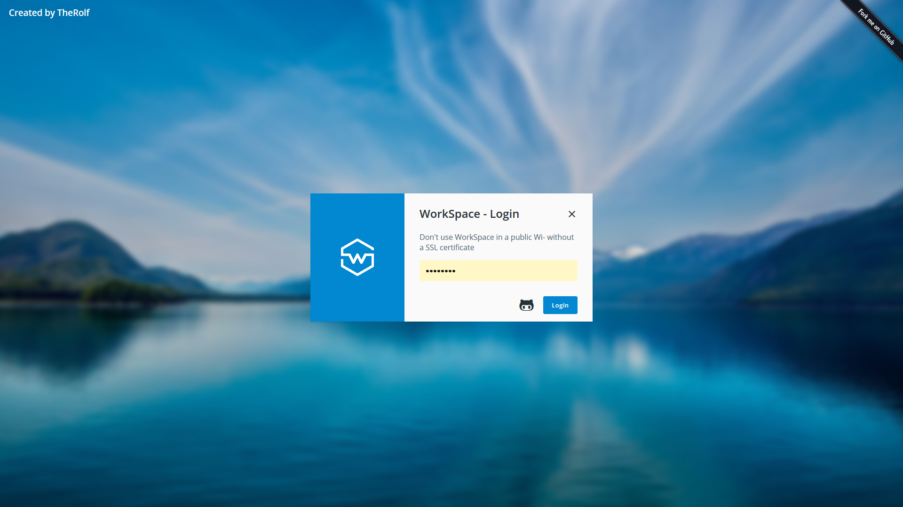
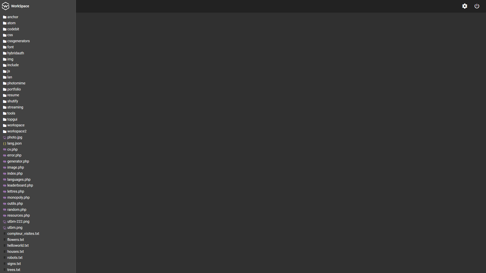
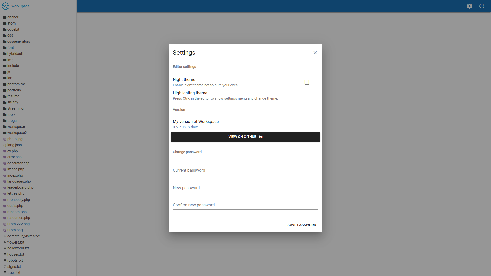

	 
	<h1>WorkSpace</h1>
	
Tool to code your website in your website

 
 
 
 
 

## New things in WorkSpace 2.0
- No jQuery
- Vue and Vuetify
- Night mode

## Installation
### 1. Unzip WorkSpace in your hosting
### 2. Modify your password
### 3. Enjoy !
## License

License: <a href="https://opensource.org/licenses/NPOSL-3.0">Non-Profit Open Software License 3.0 (NPOSL-3.0)</a>
